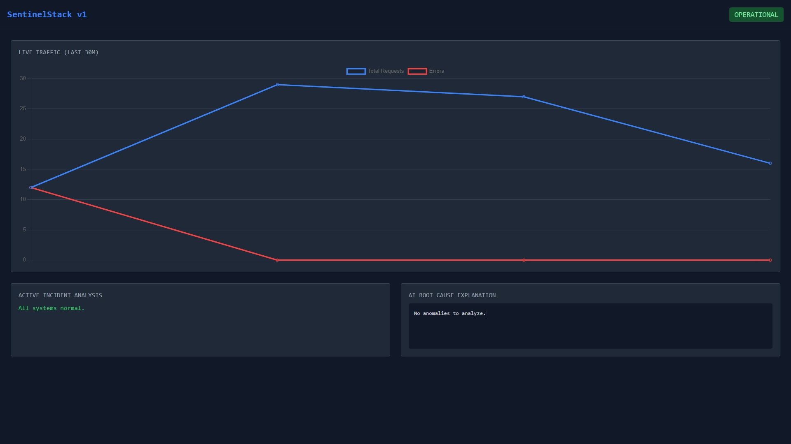
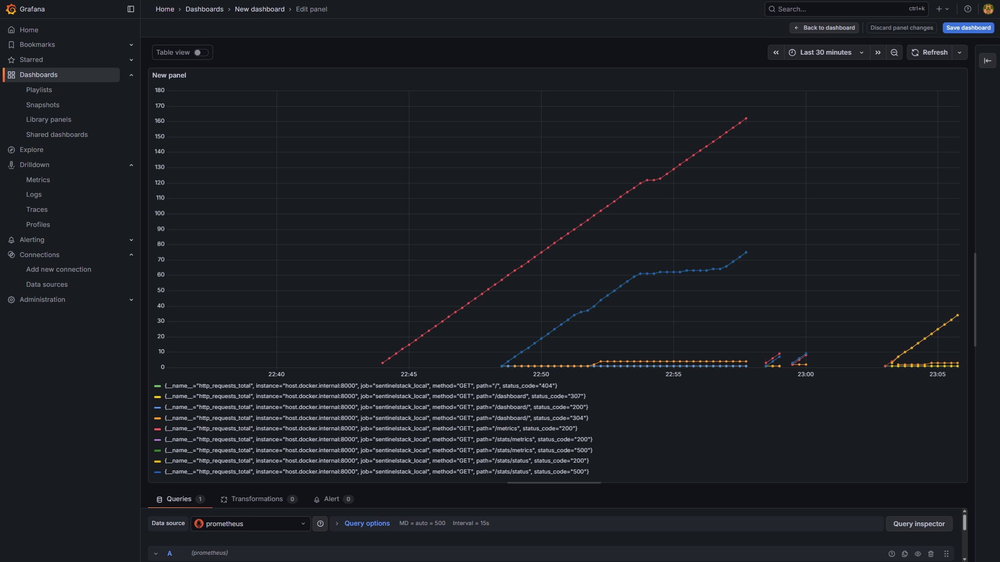
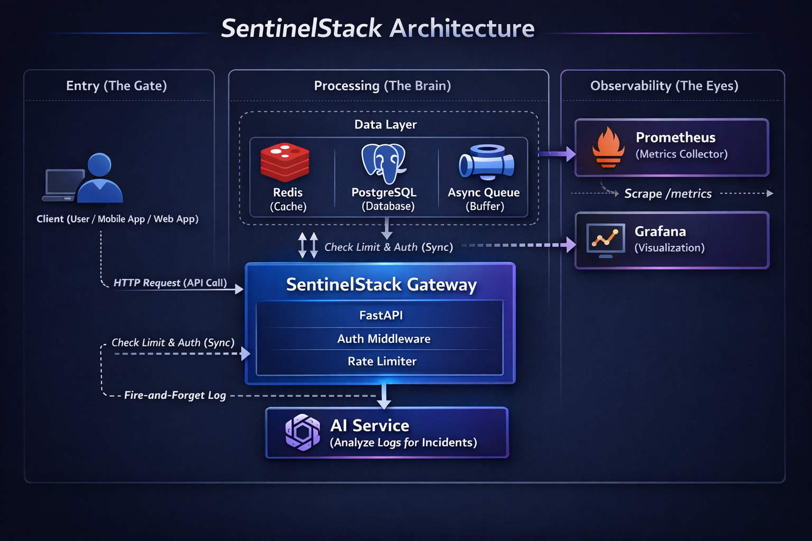
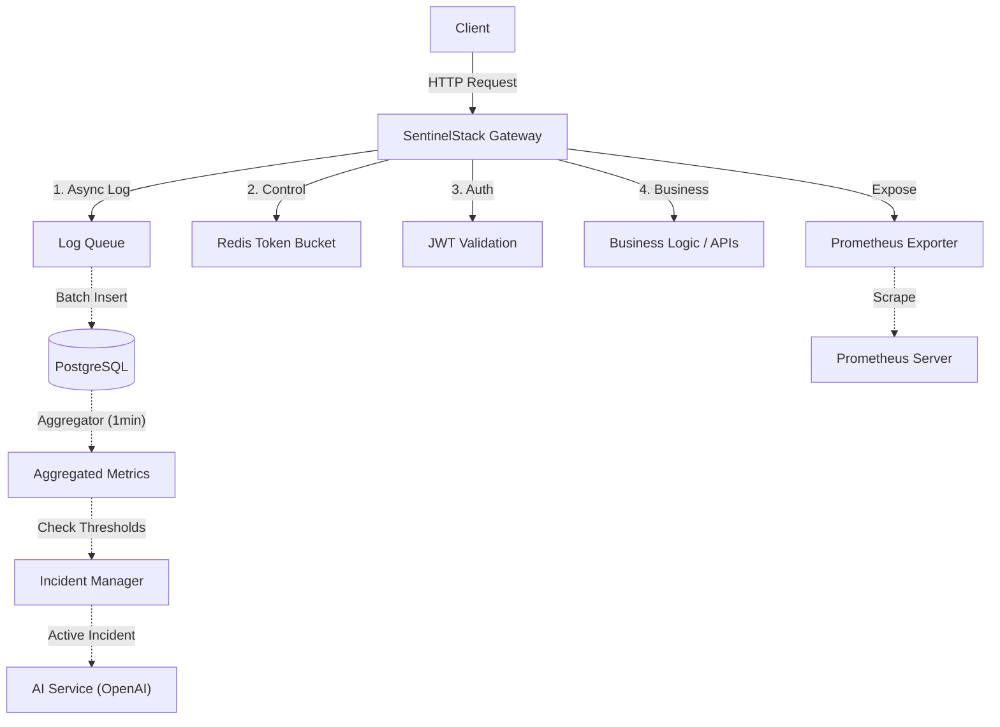

# SentinelStack v1

> **A High-Performance API Gateway Infrastructure for Control, Security, and Observability.**

### 🔴 **[Live Deployment](YOUR_DEPLOYMENT_URL_HERE)**

| **Live Dashboard** | **Grafana Metrics** |
|:---:|:---:|
|  |  |

### 🏗️ Architecture

<!-- User Note: Please upload your architecture diagram as docs/images/architecture.png -->

---


## 👁️ Overview

**SentinelStack** is a production-oriented API Gateway designed to be the hard outer shell of your application infrastructure. It sits in front of your business logic, providing a unified layer for identity management, traffic control, and **AI-driven** intelligent observability.

Unlike generic reverse proxies, SentinelStack integrates **deterministic rate limiting**, **stateless authentication**, and **automated incident analysis** directly into the request lifecycle.

## 🏗️ Architecture

SentinelStack follows a Gateway-First design philosophy where cross-cutting concerns are handled before traffic reaches business logic.



## 🚀 Key Features

-   **🤖 AI-Powered Incident Response**: Automatically detects anomalies and uses LLMs (OpenAI) to generate root cause analysis and mitigation steps.
-   **🛡️ Robust Identity & Auth**: Secure, stateless authentication using JWT and Bcrypt.
-   **⚡ Deterministic Rate Limiting**: Redis-backed Token Bucket algorithm ensures precise traffic control per user/IP.
-   **📊 Real-time Aggregation**: Background workers process raw logs into 1-minute metric buckets for high-performance querying.
-   **🚀 Asynchronous Architecture**: Non-blocking request logging ensures zero impact on gateway latency.
-   **👁️ Monitoring Stack**: 
    -   **Built-in Dashboard**: Real-time status at `/dashboard`.
    -   **Prometheus**: Scrapes `/metrics` for throughput, latency, and error rates.
    -   **Grafana**: Visualizes real-time performance on port `3001`.
-   **✅ CI/CD Ready**: GitHub Actions pipeline for linting, testing, and Docker build verification.

## 🛠️ Technology Stack

-   **Core Framework**: Python 3.10+, FastAPI, Pydantic
-   **Database**: PostgreSQL (AsyncPG), SQLAlchemy 2.0
-   **Caching & Throttling**: Redis (AsyncIO) + Lua Scripts
-   **AI & Logic**: OpenAI API, Custom Heuristics
-   **Monitoring**: Prometheus, Grafana
-   **Infrastructure**: Docker & Docker Compose

## ⚡ Getting Started (Local Development)

### Prerequisites
-   Docker & Docker Compose
-   Python 3.10+
-   OpenAI API Key (Optional, for AI features)

### Installation

1.  **Clone the Repository**
    ```bash
    git clone https://github.com/shriramrajat/sentinelstack.git
    cd SentinelStack
    ```

2.  **Configure Environment**
    Create `.env.prod` and add your secrets:
    ```properties
    OPENAI_API_KEY=sk-...
    ```

3.  **Run with Docker**
    ```bash
    docker compose --env-file .env.prod -f docker-compose.prod.yml up -d --build
    ```

4.  **Access the Services**
    -   **API**: `http://localhost:8000`
    -   **Dashboard**: `http://localhost:8000/dashboard`
    -   **Docs**: `http://localhost:8000/docs`
    -   **Grafana**: `http://localhost:3001` (User: `admin` / `admin`)
    -   **Prometheus**: `http://localhost:9090`

## 🧪 Running Tests

To run the integration test suite:

```bash
# Install dependencies
pip install -r requirements.txt

# Run tests
pytest
```

## ☁️ Deployment (Production)

1.  **Prepare Server**: Ubuntu 24.04 LTS with Docker.
2.  **Configure Secrets**: Create `.env.prod`.
3.  **Deploy**:
    ```bash
    docker compose --env-file .env.prod -f docker-compose.prod.yml up -d
    ```


## 📄 License
Proprietary / Confidential. All rights reserved.